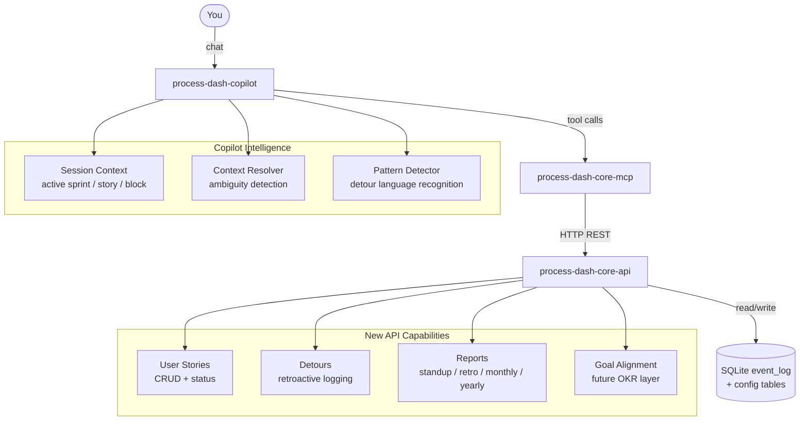

# Process Dash — Plan
## Part 6: Full Vision — User Stories, Detours, Copilot Intelligence, Reports & OKR Alignment

---

## 1. What This Part Covers

This part captures the full evolved vision of Process Dash based on real usage intent. It goes beyond the basic time-logging prototype and defines what the system needs to become to be genuinely useful for a working engineer across multiple projects and years.

The core insight driving this plan:

> The system must be honest about how people actually work — not how they wish they worked.
> People forget to log. People get pulled into things they didn't plan. People can't always stop to update a record in the moment. The system must accommodate this without losing data integrity.

---

## 2. How You Actually Work (The Reality Model)

Understanding the real workflow is the prerequisite for designing the right system.

```
Sprint starts
  └── You have committed user stories (planned work)
        │
        ├── You work a story → block it → interruptions happen (MEETING, FAMILY, etc.)
        │     └── Block ends → outcome captured
        │
        ├── Adhoc/detour work arrives mid-sprint
        │     └── You may not log it immediately
        │     └── You log it later retroactively — possibly at end of day or next day
        │
        ├── Unlogged gaps exist (you worked but didn't record it yet)
        │
        └── Sprint ends → you want:
              - Stand-up ready summaries
              - Retro points (what fragmented you, what detoured you)
              - Evidence of delivery vs plan
              - Monthly / yearly rollup across all projects

Future layer:
  Org sets goals (OKRs) → you align your stories and work to those goals
  → app can show you how much of your time maps to each organisational objective
```

---

## 3. Core Concepts to Add to the Data Model

### 3.1 User Stories

A User Story is a named, estimable unit of planned work committed to a sprint. It is the anchor everything else hangs from.

| Field | Description |
|---|---|
| `storyId` | UUID |
| `sprintId` | The sprint it belongs to |
| `projectId` | The project it belongs to |
| `title` | Short name (e.g. "Auth token refresh") |
| `description` | Optional detail |
| `storyPoints` | Optional estimate (Fibonacci: 1, 2, 3, 5, 8, 13) |
| `status` | `TODO` → `IN_PROGRESS` → `DONE` → `CARRIED_OVER` |
| `acceptanceCriteria` | Optional free text |
| `createdAt` | When committed to the sprint |

Focus blocks are linked to a story: when you start a block, you say which story you're working on. This creates the chain: **Sprint → Story → Block → Interruptions**.

### 3.2 Detours (Unplanned / Adhoc Work)

A Detour is work that was not committed in sprint planning — it was given to you mid-sprint or you had to do it reactively. It is distinct from a User Story because:
- It was not planned
- It consumes sprint capacity that wasn't budgeted
- It needs to be visible in retros and reports as *unplanned load*

| Field | Description |
|---|---|
| `detourId` | UUID |
| `sprintId` | Sprint it fell in (auto-detected or manually set) |
| `projectId` | Project (optional — detours can be cross-project) |
| `title` | What it was |
| `reason` | Why it happened (`URGENT_BUG`, `MANAGER_REQUEST`, `SUPPORT`, `MEETING_FOLLOWUP`, `OTHER`) |
| `estimatedMinutes` | Optional effort estimate |
| `loggedAt` | When the detour was recorded |
| `occurredAt` | When the detour actually happened (can be in the past — retroactive) |
| `status` | `LOGGED` | `COMPLETED` |

The key design decision: **`loggedAt` and `occurredAt` are separate fields.** This explicitly supports retroactive logging without corrupting the timeline. The system accepts that you logged it late — it still records when it actually happened.

### 3.3 Retroactive Logging

Retroactive logging means recording something that happened in the past. This is first-class supported, not a workaround.

Rules:
- Any event can carry an `occurredAt` timestamp that differs from `ts` (the wall-clock record time)
- The copilot must understand phrases like "this morning I had a 2-hour detour on the auth bug" and log with `occurredAt = today 9am`, `ts = now`
- Rollups use `occurredAt` for metrics, not `ts`
- The UI shows a visual indicator when a record was logged retroactively (loggedAt significantly later than occurredAt)

This is consistent with established time-tracking best practice: "Log time in multiple ways — real-time timer or retrospectively in a timesheet" (Scoro, 2025).

---

## 4. Copilot Intelligence: Context Resolution

The copilot's hardest job is not generating text — it is **understanding which record to act on** when the user's message is ambiguous. This is the critical design challenge for `process-dash-copilot`.

### 4.1 The Ambiguity Problem

```
User: "I just finished the auth work"
```

This could mean:
- Ended the current open focus block
- Marked a user story as DONE
- Both
- A specific block from earlier today

The copilot must resolve this intelligently rather than guessing blindly.

### 4.2 Context Resolution Strategy

The copilot maintains a **session context** — a lightweight in-memory state of what it knows about the current sprint and day:

```json
{
  "activeSprint": { "id": "...", "name": "Sprint 14", "endDate": "2026-07-04" },
  "activeStory": { "id": "...", "title": "Auth token refresh", "status": "IN_PROGRESS" },
  "openBlock": { "blockId": "...", "startedAt": "2026-06-23T09:15:00Z" },
  "todayDate": "2026-06-23"
}
```

Resolution rules (applied in order):
1. If there is an open block, prefer resolving "finish" / "done" / "end" against that block
2. If the message mentions a story title or keyword matching a committed story, prefer that story
3. If the message mentions a sprint by name or "this sprint", resolve to the active sprint
4. If genuinely ambiguous, ask one clarifying question before acting

This approach mirrors research on LLM tool calling ambiguity: "LLMs bias toward one interpretation among many — the system must detect missing context and ask before committing" (arXiv, 2025).

### 4.3 Detour Capture via Copilot

The copilot should recognise detour language patterns:
- "I got pulled into..." → detour
- "Had to deal with..." → detour
- "X asked me to fix..." → detour
- "Spent an hour on..." (no matching story) → likely detour
- "Earlier today / this morning / yesterday I..." → retroactive detour

When a detour is detected the copilot should:
1. Confirm the title and rough time spent
2. Ask which sprint (default: current)
3. Ask the reason category (default: `OTHER` with option to pick)
4. Log with `occurredAt` set to the time they described, `loggedAt` = now

### 4.4 Copilot Interaction Examples

```
You:  Start working on the auth token refresh
Bot:  Started a block for "Auth token refresh" (Sprint 14). Timer running.

You:  Meeting just pulled me away
Bot:  Block interrupted — MEETING logged. Ready to resume when you're back.

You:  Done with that for now, got about 90 mins in
Bot:  Block ended. Duration: 90 mins. Outcome? (or say "skip")

You:  This morning I spent 2 hours on a support issue for the payments team
Bot:  Sounds like a detour. I'll log it as unplanned work — any idea what time it started?
You:  About 9am
Bot:  Logged as detour "Support issue — payments team", 2 hrs, occurred 9:00am today.
      Reason category? SUPPORT / MANAGER_REQUEST / URGENT_BUG / OTHER
You:  Support
Bot:  Done. That's 2 hrs of unplanned load for Sprint 14.

You:  What should I put in stand-up?
Bot:  Yesterday: Completed 2 blocks on Auth token refresh (~3h total, 1 interruption — MEETING).
      Detour: Support issue for payments team (~2h).
      Today: Continuing Auth token refresh.
      Blockers: None logged.

You:  Give me retro points for this sprint
Bot:  Sprint 14 Retro Draft:
      What slowed us down:
      - 6 MEETING interruptions across 4 stories
      - 2 detours totalling ~4.5h (SUPPORT x2)
      What went well:
      - Auth token refresh completed with 4 focus blocks ≥ 30 mins
      One thing to change next sprint:
      - (pending your input — what structural change would help?)
```

---

## 5. Reporting Vision

### 5.1 Stand-Up Report (Daily)

Generated on demand or on a schedule. Format:

```
Yesterday
- [Story] Auth token refresh — 2 blocks (~3h), 1 MEETING interruption
- [Detour] Payments support issue — 2h (unplanned)

Today
- [Story] Auth token refresh (continuing)
- [Story] Sprint review prep

Blockers
- None / [any blocked stories]
```

### 5.2 Sprint Retrospective Report

Generated at sprint end. Sections:

- **Delivery**: Stories completed vs committed (count + story points)
- **Unplanned load**: Total detour hours, breakdown by reason
- **Fragmentation**: Fragmentation rate, top interruption codes, most fragmented stories
- **Focus quality**: Number of 30+ min uninterrupted blocks per day
- **Reflection prompts**: Pre-filled from data, space for your narrative input

### 5.3 Monthly Report

Aggregates across all sprints in the calendar month:
- Total planned work hours vs detour hours
- Fragmentation trend (improving or worsening week over week)
- Story completion rate
- Top interruption sources
- Projects worked on and time split between them

### 5.4 Yearly Report

Aggregates across all months:
- Projects worked on, time distribution per project
- Total stories completed, total story points delivered
- Year-over-year fragmentation trend (if multi-year data exists)
- Top 3 detour reasons for the year
- Focus quality trend (average focus blocks per sprint)
- OKR alignment summary (future — see Section 7)

### 5.5 Multi-Project View

Since you work across multiple projects in a year, all reports support a project filter:

```
This month | All Projects
This month | Project: Authentication Service
This month | Project: Payments Platform
```

At the yearly level, the report shows a time-split chart across projects — useful for showing where your year actually went.

---

## 6. Data Model Extensions Needed

### New event types

| Event | Description |
|---|---|
| `user_story_created` | Story committed to a sprint |
| `user_story_status_changed` | Story moved to IN_PROGRESS, DONE, CARRIED_OVER |
| `detour_logged` | Unplanned work recorded (with `occurredAt` support) |
| `detour_completed` | Detour marked as done |
| `block_linked_to_story` | Associates a block with a specific story (can be retroactive) |

### New fields on existing events

- `intent_block_started` should accept `storyId` (optional) — links block to a story
- `occurredAt` field on all events — defaults to `ts`, overridable for retroactive logging

### New configuration tables

| Table | Description |
|---|---|
| `user_stories` | Story definitions per sprint/project |
| `detours` | Unplanned work records |
| `org_goals` | Future: organisational OKRs / objectives (see Section 7) |
| `goal_alignments` | Future: many-to-many between stories/detours and org goals |

---

## 7. Future: Organisational Goal Alignment (OKR Layer)

This is a planned future capability — not in immediate scope but designed for now so the data model supports it cleanly.

### The Idea

Your organisation sets goals (OKRs or strategic objectives) at the start of a year or quarter. These might be:
- "Improve platform reliability to 99.9% uptime"
- "Reduce customer onboarding time by 30%"
- "Migrate legacy auth system to OAuth 2.0"

You then tag your user stories with one or more of these goals. Over time the system can answer:

> "Out of my total working hours this quarter, 40% went to reliability work, 35% to auth migration, and 25% was unplanned/detours."

This closes the loop between individual daily work and organisational intent — a core PSP philosophy applied at the strategic level.

### Data Design

```
org_goals
  id, title, description, type (OKR | OBJECTIVE | STRATEGIC_THEME),
  period_start, period_end, project_id (nullable — org goals can be cross-project)

goal_alignments
  id, goal_id, story_id (nullable), detour_id (nullable), alignment_strength (PRIMARY | SUPPORTING)
```

### What the Copilot Can Do With This

```
You:  Tag this story to the auth migration goal
Bot:  Linked "Auth token refresh" to goal "Migrate legacy auth system to OAuth 2.0".

You:  How aligned was I with org goals this quarter?
Bot:  Q2 2026 Goal Alignment:
      Auth migration:     ~42% of working hours (12 stories, 3 detours)
      Reliability:        ~28% (8 stories)
      Onboarding speed:   ~15% (4 stories)
      Unaligned / detour: ~15% (unplanned work)
```

### Alignment Rules
- A story can align to multiple goals (PRIMARY + SUPPORTING)
- Detours default to unaligned unless manually tagged
- The copilot can suggest goal alignment based on story title and description (LLM inference)
- Goal alignment is always voluntary — never required for logging to work

---

## 8. Updated Architecture for These Features



---

## 9. Phased Build Plan

### Phase A — User Stories (Next after MCP)
- Add `user_stories` table and CRUD API endpoints
- Add `user_story_created`, `user_story_status_changed` events
- Link `intent_block_started` to `storyId`
- Frontend: story list per sprint, status board
- MCP tools: `create_story`, `update_story_status`, `list_stories`
- Copilot: understand "start working on [story]", "mark [story] done"

### Phase B — Detours
- Add `detours` table
- Add `detour_logged`, `detour_completed` events with `occurredAt` support
- API: `POST /detours`, `PATCH /detours/{id}/complete`, `GET /detours?sprintId=`
- MCP tools: `log_detour`, `complete_detour`, `list_detours`
- Copilot: detect detour language, retroactive logging flow, sprint auto-assignment

### Phase C — Reports
- Stand-up report endpoint: `GET /reports/standup/{date}`
- Sprint retro report endpoint: `GET /reports/retro/{sprintId}`
- Monthly report endpoint: `GET /reports/monthly/{year}/{month}`
- Yearly report endpoint: `GET /reports/yearly/{year}`
- Copilot: "give me my stand-up", "retro points for this sprint", "how was my month"

### Phase D — Multi-Project Reports
- All report endpoints accept optional `projectId` filter
- Yearly report includes cross-project time split
- Copilot: "how did I split my time across projects last month"

### Phase E — OKR Alignment (Future)
- Add `org_goals` and `goal_alignments` tables
- API: goal CRUD, alignment tagging endpoints
- Copilot: tag suggestions via LLM inference, goal alignment queries
- Reports: alignment summary section in monthly and yearly reports

---

## 10. Design Principles for This Phase

**1. Retroactive logging is first-class, not a workaround.**
The data model explicitly separates `occurredAt` from `loggedAt`. Research confirms this is essential: "teams can log retrospectively in a timesheet — the key is that the data eventually gets captured" (Scoro, 2025).

**2. The copilot asks before acting on ambiguity.**
Never silently guess which record to update. One clarifying question is better than corrupted data. Research confirms LLMs must detect missing concept context before committing to one interpretation (arXiv, 2505.11679).

**3. Unplanned work is visible, not hidden.**
Detours are explicitly categorised and reported. This makes the invisible visible — "tag and track scope additions, documenting when and why" (Medium / AgileLab, 2025). Stand-up and retro reports show unplanned load as a first-class metric.

**4. Reports tell the story of the sprint, not just the numbers.**
Data-driven retrospectives in 2025 require both quantitative data (fragmentation rate, detour hours) and qualitative narrative (what changed, what to do next). The copilot generates the data layer; you add the narrative.

**5. OKR alignment is voluntary and emergent.**
Individual contributors must own their own goals — "goals must be relevant to the individual contributor's career path" (Perdoo, 2025). The system supports goal alignment but never mandates it. It surfaces the data; you decide what it means.

**6. Privacy stays local.**
All data — including org goals and personal reflections — stays in your local SQLite. Nothing leaves your machine unless you explicitly export it.
