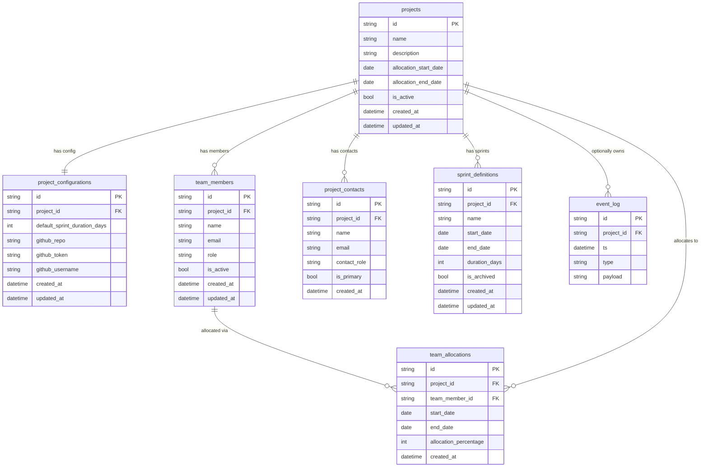

# Data Model

## Core Principle

All work data is stored as **append-only events** in a single `event_log` table. Nothing is ever updated or deleted. Every other table (`projects`, `sprint_definitions`, etc.) stores configuration — not work data. Rollups and metrics are always derived by replaying events at read time.

---

## Tables

### event_log

The heart of the system. Every user action produces one or more events here.

| Column | Type | Description |
|---|---|---|
| `id` | UUID | Primary key |
| `ts` | datetime (UTC) | When the event was recorded |
| `type` | string | Event type (see Event Types below) |
| `payload` | JSON string | Event-specific data |
| `project_id` | UUID (FK, nullable) | Optional project association |

---

### projects

Configuration table for named projects. Work events are optionally linked to a project via `project_id` on `event_log`.

| Column | Type | Description |
|---|---|---|
| `id` | UUID | Primary key |
| `name` | string | Project name |
| `description` | string (nullable) | Optional description |
| `allocation_start_date` | date (nullable) | When work on this project started |
| `allocation_end_date` | date (nullable) | When work on this project ended |
| `is_active` | bool | Whether the project is active (default: true) |
| `created_at` | datetime | Row creation timestamp |
| `updated_at` | datetime | Last update timestamp |

---

### project_configurations

One-to-one with `projects`. Stores GitHub integration settings and sprint defaults per project.

| Column | Type | Description |
|---|---|---|
| `id` | UUID | Primary key |
| `project_id` | UUID (FK) | Owning project |
| `default_sprint_duration_days` | int | Default sprint length (default: 14) |
| `github_repo` | string (nullable) | GitHub repo slug (`owner/repo`) |
| `github_token` | string (nullable) | Personal access token for GitHub API |
| `github_username` | string (nullable) | GitHub username for activity filtering |
| `created_at` | datetime | Row creation timestamp |
| `updated_at` | datetime | Last update timestamp |

---

### sprint_definitions

Defines time-boxed sprints. Sprints have a start date, duration, and derived end date. Work metrics are computed by replaying events within the sprint's date range.

| Column | Type | Description |
|---|---|---|
| `id` | UUID | Primary key |
| `project_id` | UUID (FK, nullable) | Owning project |
| `name` | string | Sprint name (e.g. "Sprint 12") |
| `start_date` | date | First day of the sprint |
| `end_date` | date | Last day (`start_date + duration_days - 1`) |
| `duration_days` | int | Sprint length in days (1–60) |
| `is_archived` | bool | Soft-delete flag (default: false) |
| `created_at` | datetime | Row creation timestamp |
| `updated_at` | datetime | Last update timestamp |

Sprint summaries (reflections) are **not** stored in this table — they are stored as `sprint_summary_saved` events in `event_log`.

---

### team_members

People associated with a project.

| Column | Type | Description |
|---|---|---|
| `id` | UUID | Primary key |
| `project_id` | UUID (FK) | Owning project |
| `name` | string | Member name |
| `email` | string (nullable) | Email address |
| `role` | string | Role (default: `CONTRIBUTOR`) |
| `is_active` | bool | Active flag (default: true) |
| `created_at` | datetime | Row creation timestamp |
| `updated_at` | datetime | Last update timestamp |

---

### project_contacts

External stakeholders associated with a project.

| Column | Type | Description |
|---|---|---|
| `id` | UUID | Primary key |
| `project_id` | UUID (FK) | Owning project |
| `name` | string | Contact name |
| `email` | string (nullable) | Email address |
| `contact_role` | string | Role (default: `STAKEHOLDER`) |
| `is_primary` | bool | Whether this is the primary contact |
| `created_at` | datetime | Row creation timestamp |

---

### team_allocations

Records a team member's allocation to a project over a date range.

| Column | Type | Description |
|---|---|---|
| `id` | UUID | Primary key |
| `project_id` | UUID (FK) | Owning project |
| `team_member_id` | UUID (FK) | Allocated team member |
| `start_date` | date | Allocation start |
| `end_date` | date (nullable) | Allocation end (null = ongoing) |
| `allocation_percentage` | int | Percentage of capacity (1–100, default: 100) |
| `created_at` | datetime | Row creation timestamp |

Overlapping allocations for the same member on the same project are rejected.

---

## Event Types

### Daily Intents

#### `daily_intents_set`
Declares up to 5 intents for a working day. Latest event for a date wins.

```json
{
  "date": "2026-06-23",
  "intents": ["Auth refactor", "Code review", "Sprint sync"]
}
```

---

### Focus Blocks

#### `intent_block_started`
Starts a timed focus block for a specific intent.

```json
{
  "blockId": "uuid",
  "date": "2026-06-23",
  "intent": "Auth refactor",
  "notes": "Picking up from yesterday",
  "projectId": "uuid or null"
}
```

#### `intent_block_interrupted`
Marks the current block as interrupted with a reason code.

```json
{
  "blockId": "uuid",
  "reasonCode": "MEETING"
}
```

Valid reason codes: `MEETING`, `DEPENDENCY`, `CONTEXT_SWITCH`, `FAMILY`, `EMOTIONAL_LOAD`, `TECH_ISSUE`, `UNPLANNED_REQUEST`

#### `intent_block_ended`
Closes a focus block with duration and outcome.

```json
{
  "blockId": "uuid",
  "actualOutcome": "Partial — got through token refresh logic",
  "durationMinutes": 75
}
```

---

### Recovery Blocks

#### `recovery_block_started`
Starts a break.

```json
{
  "blockId": "uuid",
  "kind": "COFFEE",
  "date": "2026-06-23"
}
```

Valid kinds: `COFFEE`, `LUNCH`

#### `recovery_block_ended`
Closes a break with duration.

```json
{
  "blockId": "uuid",
  "durationMinutes": 15
}
```

---

### Sprints

#### `sprint_summary_saved`
Records a sprint reflection. Latest event per `sprintId` is the active summary.

```json
{
  "sprintId": "uuid",
  "topFragmenters": ["MEETING", "CONTEXT_SWITCH"],
  "notPerformanceIssues": ["Environment instability", "Dependency wait"],
  "oneChangeNextWeek": "Cluster all meetings post-lunch"
}
```

---

### Todos

#### `todo_added`
Creates a todo item for a specific date.

```json
{
  "todoId": "uuid",
  "text": "Review PR #142",
  "date": "2026-06-23"
}
```

#### `todo_completed`
Marks a todo as done.

```json
{
  "todoId": "uuid",
  "completionDate": "2026-06-23"
}
```

#### `todo_uncompleted`
Re-opens a completed todo.

```json
{
  "todoId": "uuid",
  "completionDate": "2026-06-23"
}
```

#### `todo_deleted`
Soft-deletes a todo (excluded from all replays).

```json
{
  "todoId": "uuid"
}
```

---

### Legacy

#### `weekly_summary_saved` *(read-only)*
Pre-sprint format from the original weekly workflow. Can be migrated to `sprint_summary_saved` via `scripts/backfill_weekly_summaries_to_sprints.py`. No new events of this type should be created.

---

## How Rollups Work

Rollups are never stored — they are computed on every read by replaying relevant events.

### Day Rollup (`GET /api/days/{date}`)

1. Find the latest `daily_intents_set` event for the date → extracts intent list
2. Replay all `intent_block_*` events → reconstructs each block's state (started → interrupted? → ended)
3. Replay all `recovery_block_*` events → reconstructs recovery blocks
4. Replay all `todo_*` events for the date → builds todo list with completion state
5. Compute metrics from the reconstructed blocks

### Sprint Rollup (`GET /api/sprints/{id}/rollup`)

1. Load the `SprintDefinition` to get `start_date` and `end_date`
2. Replay all `intent_block_*` and `recovery_block_ended` events within the date range
3. Count interruptions by reason code → produces `topFragmenters`
4. Find latest `sprint_summary_saved` event for the sprint → appends reflection data

---

## Computed Metrics

| Metric | Formula |
|---|---|
| `totalBlocks` | Count of `intent_block_started` events in the period |
| `interruptedBlocks` | Count of blocks with an `intent_block_interrupted` event |
| `fragmentationRate` | `interruptedBlocks / totalBlocks` (0.0–1.0) |
| `focusBlocks` | Blocks that were not interrupted AND `durationMinutes >= 30` |
| `totalActiveMinutes` | Sum of `durationMinutes` across all blocks |
| `totalActiveLabel` | Human-readable bucket (e.g. `~2 hours`, `~½ day`, `> 1 day`) |
| `totalRecoveryMinutes` | Sum of `durationMinutes` from recovery blocks |
| `totalRecoveryLabel` | Human-readable bucket for recovery time |
| `todosAdded` | Count of todos created on the day |
| `todosCompleted` | Count of todos where `completionDate` matches the day |

---

## Entity Relationships



### Event Flow

```mermaid
flowchart TD
    U([User Action]) --> API[core-api]
    API --> EL[(event_log\nappend-only)]

    EL --> DR[Day Rollup]
    EL --> SR[Sprint Rollup]
    EL --> TR[Todo State]

    DR --> DV[DayView / Today]
    SR --> SV[SprintSummaries]
    TR --> TV[Todos page]

    subgraph Config Tables
        P[projects]
        SD[sprint_definitions]
        PC[project_configurations]
        TM[team_members]
    end

    Config Tables --> API
```

Work events (`intent_block_*`, `recovery_block_*`, `daily_intents_set`, `todo_*`, `sprint_summary_saved`) are the source of truth. All other tables are configuration that shapes how events are queried and displayed.
